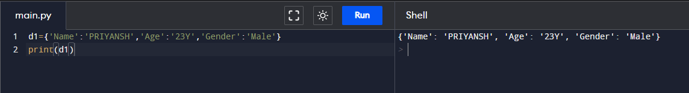
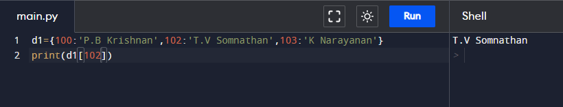
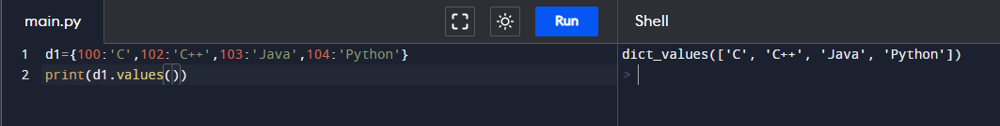
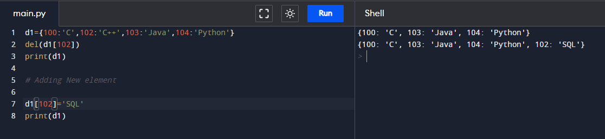
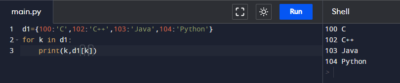
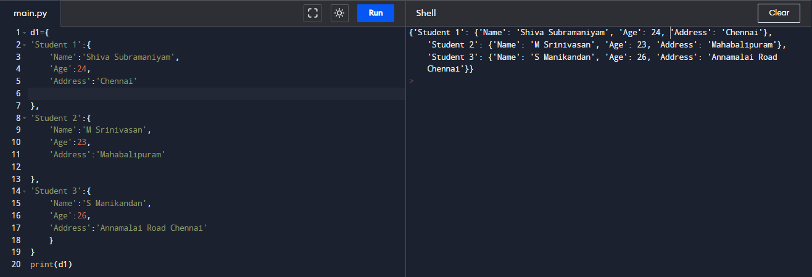
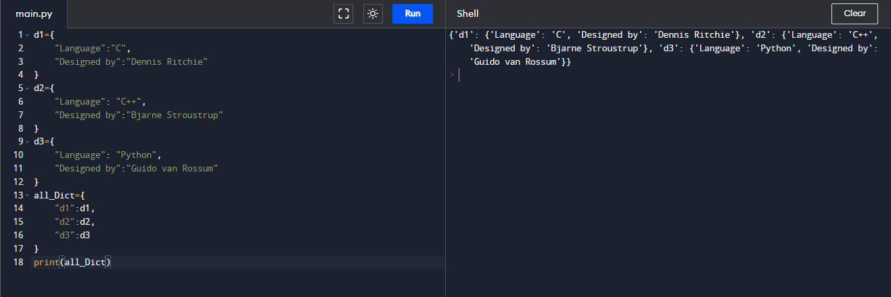
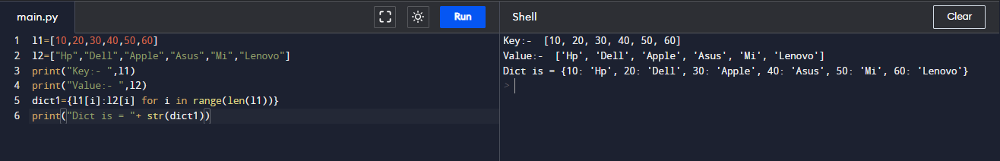
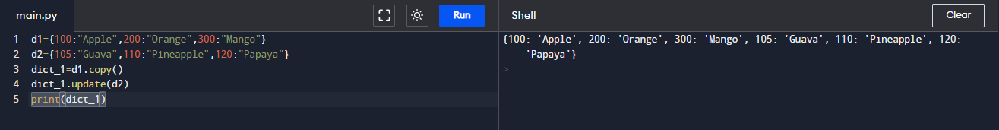
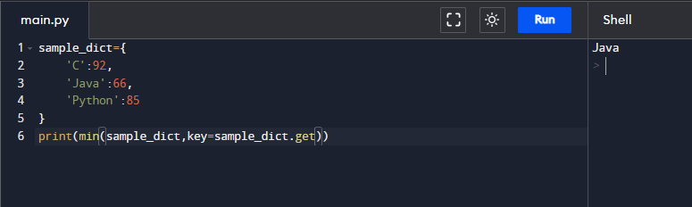

# Assignment - 18 Full Stack Web Development using Python MySirG Dictionary

    Qns 1. Write a python program to create and print a dictionary which stores your information. 
    (name, age, gender .....)

    Ans.

    Qns 2. Write a python program to access the items of a dictionary by referring to its key name.

    Ans.

    Qns 3. Write a python program to get a list of the values from a dictionary.

    Ans.

    Qns 4. Write a python program to change the value of a specific item by referring to its key name.

    Ans.

    Qns 5. Write a python program to print all key names in the dictionary, one by one.

    Ans.

    Qns 6. Write a python program to create a dictionary that contains three dictionaries.
    (nested)

    Ans.

    Qns 7. Write a python program to create three dictionaries, then create one dictionary that will contain the other three dictionaries.

    Ans.

    Qns 8. Write a python program to convert two lists into a dictionary in a way that item from list1 is the key and item from list2 is the value.

    Ans.

    Qns 9. Write a python program to merge two python dictionaries into one dictionary.

    Ans.

    Qns 10. Write a python program to get the key of lowest value from the dictionary.
        sample_dict = {
            'C': 92,
            'Java': 66,
            'Python': 85
        }

    Ans.
